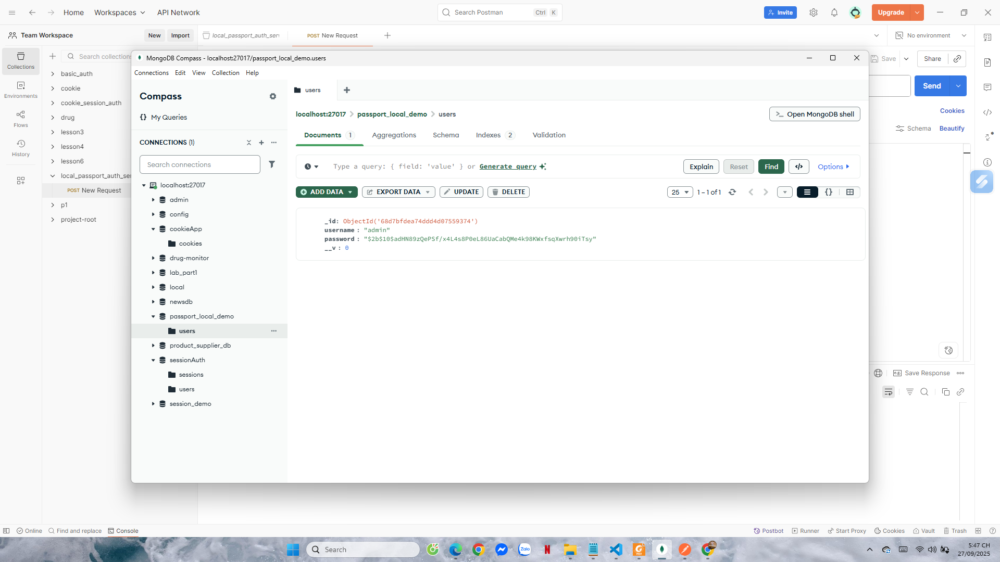
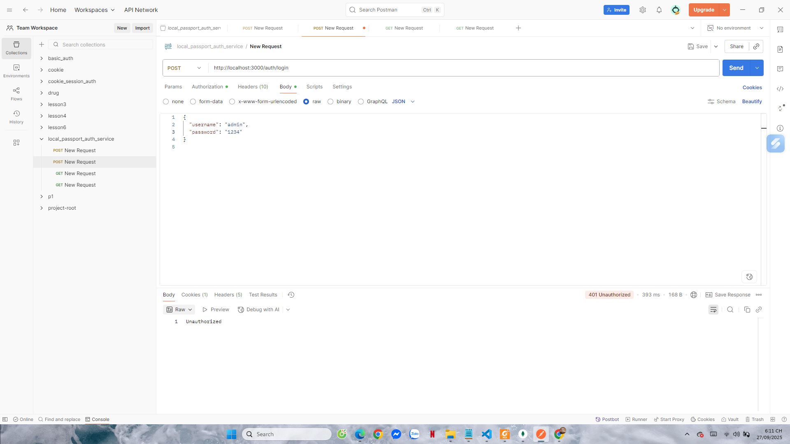
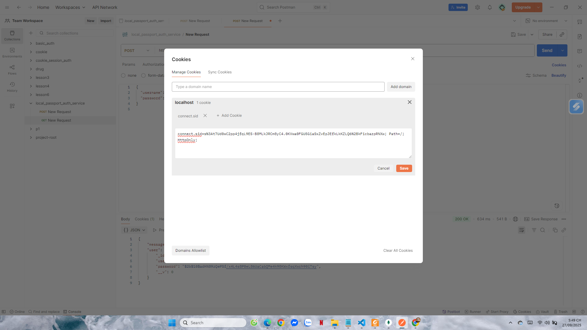
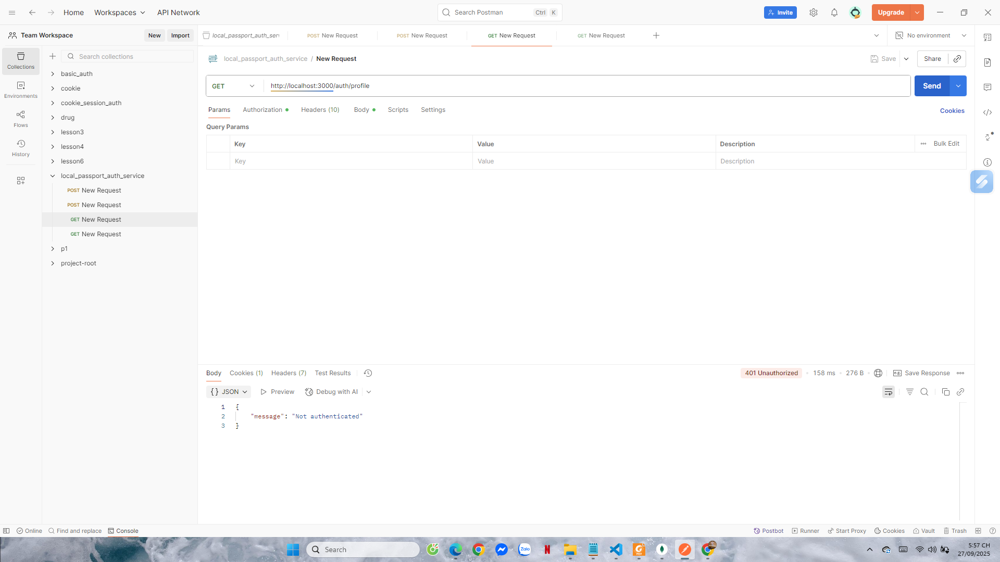
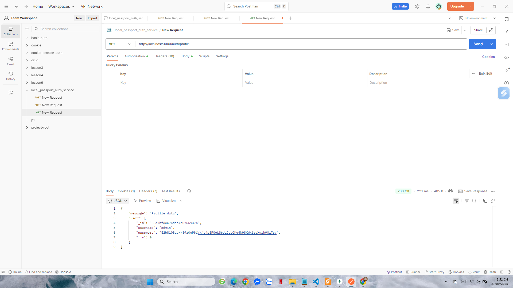
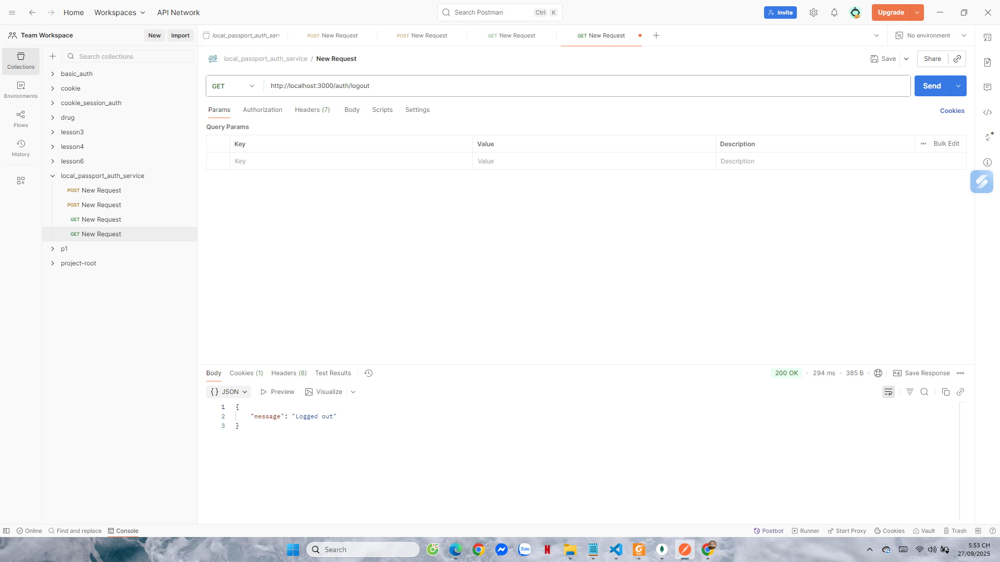
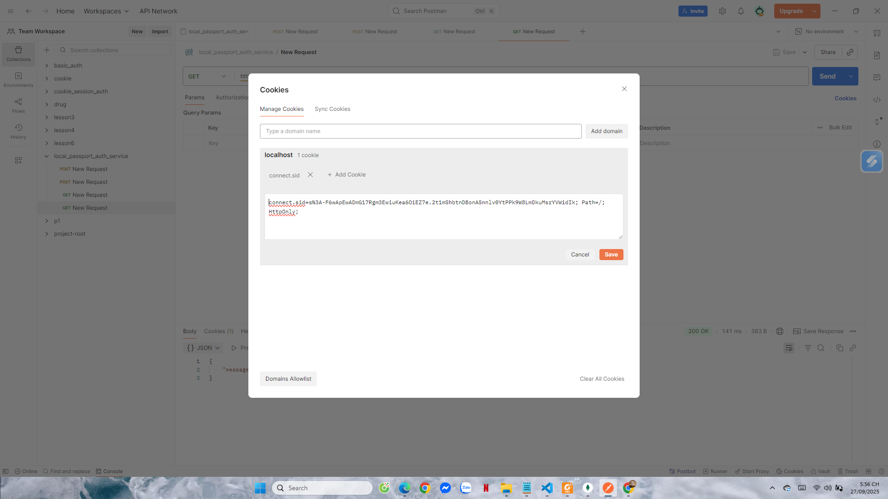

# Project 3: Local Passport Authentication Service

## Cách chạy
Cài đặt dependencies:
```bash
npm install
node app.js
```

Server chạy tại: http://localhost:3000  
Database: passport_local_demo (MongoDB)  

---

## 1. Register
Request
```http
POST /auth/register
Content-Type: application/json
{
  "username": "admin",
  "password": "12345"
}
```

Kết quả test
- Response: "User registered successfully"
- MongoDB có user mới

Ảnh test:  
  


---

## 2. Login
Request
```http
POST /auth/login
Content-Type: application/json
{
  "username": "admin",
  "password": "12345"
}
```

Kết quả test
- Sai password → 401 Unauthorized  


- Đúng username/password → "Login successful"  


- Tab Cookies trong Postman có connect.sid  


---

## 3. Profile (Protected route)
Request
```http
GET /auth/profile
```

Kết quả test
- Chưa login → 401 Unauthorized  


- Đã login → trả về thông tin user  


---

## 4. Logout
Request
```http
GET /auth/logout
```

Kết quả test
- Response: "Logged out"  


- Cookie connect.sid vẫn còn trong Postman  


Giải thích  
Trong code hiện tại, `req.logout()` chỉ xóa user khỏi session. Passport không tự xóa cookie phía client. Vì vậy cookie connect.sid vẫn hiện, nhưng session đã vô hiệu. Khi gọi lại /auth/profile sẽ trả về 401 Unauthorized. Đây là hành vi mặc định và hợp lệ của Passport.

---

## Hoàn thành
- app.js → cấu hình server, session, Passport Local
- routes/auth.js → xử lý register, login, profile, logout
- Test đầy đủ các trường hợp:
  - Register thành công
  - Login sai → Unauthorized
  - Login đúng → success + cookie session
  - Profile: chưa login vs đã login
  - Logout → session invalid (cookie vẫn còn nhưng vô hiệu)

Ảnh minh họa test: nằm trong thư mục public/results/
